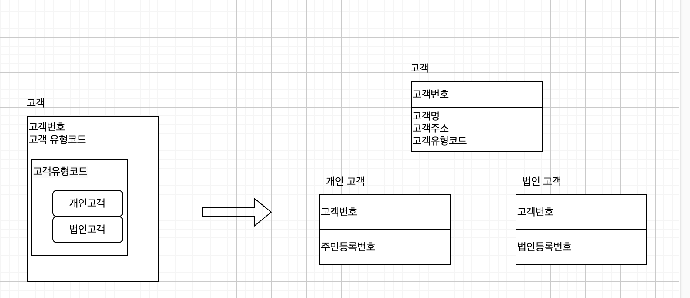
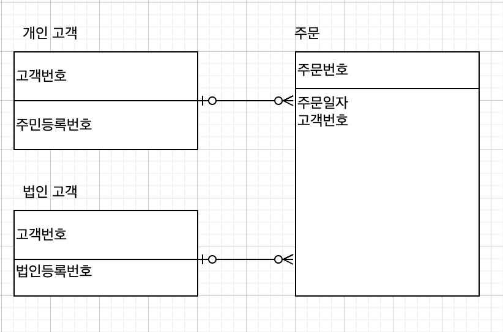
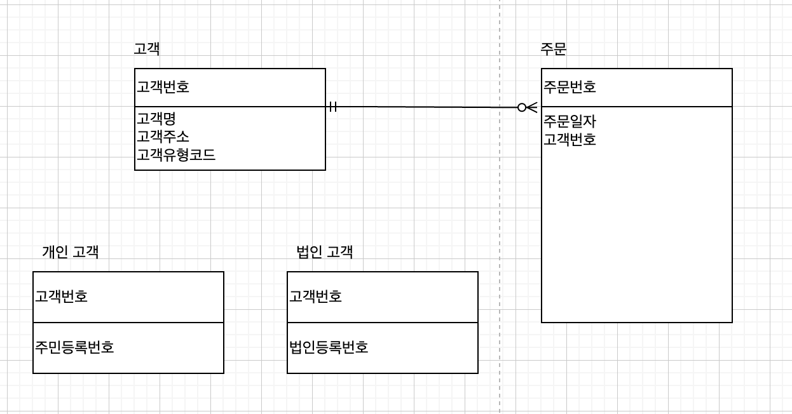
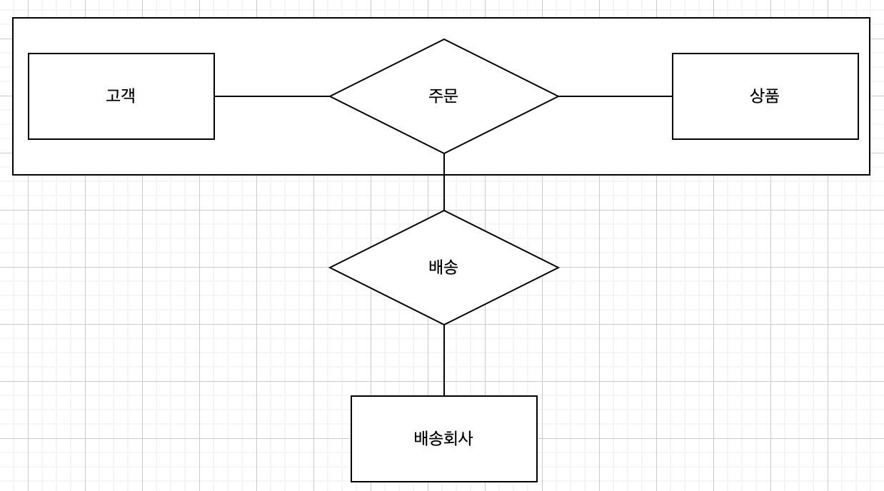

# 데이터 모델링 이론

## 데이터 모델링이란?

데이터모델링은 영속성을 갖는 데이터에 대한 시스템 구조를 사람이 이해할 수 있도록 형상화하는 과정

## 형상화하는 과정은 어떻게 되는가?

1. 사람이 정보로서 의미있는 대상을 인지하고, 식별 (개념적)
2. 기호등으로 추상화해서 표현 (논리적)
3. 추상화된 모델을 구체화된 형태로 변환 (물리적)

### 모델 표현방법은 여러개인가?

관계 모델, 계층 모델, 망모델등이 있고, 보통 ER모델 즉 관계모델을 많이 사용한다.
실무에서 일하면서 관계모델만 봤다.

### 엔티티 도출은 무엇이고, 왜 하는가?

데이터 모델링 작업은 현행 업무를 파악해서 개념들을 정리, 분류해 엔티티, 속성, 관계로 형성화할 수 있다.

인터넷 뱅킹을 엔티티 도출한다면, **개인, 기업, 상품, 예금, 대출, 가입, 생년월일, 가입금액** 등등으로 나눌 수 있다.

도출된 개념 중 상품, 가입처럼 복합 정보를 가지고 있으면, 엔티티로 식별하고, 생년월일, 가입금액같은 단일 정보는 속성으로 분류한다.

### ER 모델의 질적 특성

#### 완전성

요구사항을 만족하고 있는지 검토해야한다. 상품 단가가 변경된다면 주문시 상품 수량뿐만 아니라 상품 금액도 같이 관리해야한다.

#### 정확성

ER 모델의 개념대로 데이터모델을 작성해야한다. -> 그냥 메뉴얼 대로 규칙을 잘지켜서 하라는 말 같음.

#### 최소성

요구사항의 모든 특성이 ER 모델에 한 번만 나타나도록 설계해야한다.

부서와 직원 엔티티에서 특정 부서의 직원 수는 직원 엔티티에서 특정 부서에 속한 직원 수를 구하면 되므로 부서에서 직원 수 속성을 가지고 있을 필요가 없다.

부서별로 직원 수 속성을 가지고 있다면 반정규화이며, 부서별로 직원수를 구하기 위한 연산을 최소화할 수 있지만, 정합성을 계속 맞추어야 한다.

#### 자명성

설명이나 증명을 하지 않아도 요구사항에 대한 뜻이나 의미를 명확히 설명할 수 있어야한다.

#### 확장성

향후 업무 범위나 규모가 확대되거나 변경될 경우 새로운 요구사항을 쉽게 반영할 수 있도록 유연한 모델을 설계해야 한다. -> 이게 가장 어려운것 같다.

#### 표현성

주소1, 주소2 보다는 고객기본주소, 고객상세주소 등등 속성명을 부여하는 것이 더 직관적이다.

### ER 모델 구성요소

엔티티, 관계, 속성

### 엔티티

현실 세계에 존재하는 실체이거나 개념적인것, 엔티티는 적어도 둘 이상의 인스턴스가 존재할 수 있어야하고, 인스턴스를 식별할 수 있는 속성이나 관계가 하나 이상 정의해야 한다
-> 속성은 기본키인것 같고, 관계는 외래키인것 같다.

엔티티는 슈퍼타입 엔티티, 서브타입 엔티티로 확장이 가능하다.

슈퍼타입 엔티티: 하나 이상의 서브타입 엔티티와 관계를 가지고 있어야한다.

서브타입 엔티티: 각각의 서브타입에만 존재하는 고유한 속성을 관리한다. 그리고 슈퍼타입의 식별자, 속성, 관계 등 모든 특성을 상속받는다 -> 뭔가 객체지향이랑 느낌이 비슷하다.

---

엔티티는 그림과 같이 슈퍼타입 엔티티나 서브타입 엔티티로 확장할 수 있다.
슈퍼타입, 서브타입 엔티티는 일반화/특수화 과정을 통해 도출된다.

즉 나는 엔티티를 파악하고 일반화, 특수화를 통해 데이터를 이해하기 쉽게 도식화하는 능력을 배우면 된다.

그림을 설명해보자면 슈퍼타입인 고객은 서브타입인 개인, 법인 고객과 관계를 가지고, 고객 공통 속성 고객명, 고객주소는 슈퍼타입 엔티티에서 관리한다.

주민등록 번호는 개인 고객에만 해당함으로 개인고객에서 관리, 법인등록 번호는 법인고객에서 관리한다.

---

### 일반화가 무엇인가?

일반화는 둘 또는 그 이상의 실체유형 요소간에 서브세트(부분집합)를 정의하는 개념이다.

### 엔티티 일반화를 하는 이유

일반화는 데이터베이스를 더 간결하고 효율적으로 만들어주기 위해서이다.

### 왜 일반화는 데이터베이스를 간결하고 효율적으로 변경하는가?

엔티티 각각이 가지고 있는 고유한 특징을 파악해서, 공통의 속성으로 재정의하기 때문이다.
에를 들어 개인과 기업이 있다고 했을 때, 공통적인 성격을 묶어 고객으로 정의하고, 제품과 상품을 큰 틀에서 상품으로 재정의 하는것도 포함된다.

### 간단하게 말해보자면?

2개 이상의 여러개 엔티티가 존재할 때 공통점을 찾아내서 하나의 공통된 엔티티를 만드는 것이다.

### 일반화도 종류가 여러개이다.

인스턴스 존재 유형에 따라 완전/불완전, 배타적/포괄적 일반화로 나눌 수 있다.

- 완전/불완전 기준

  - 완전

    상위 수준 엔티티(슈퍼타입)의 모든 인스턴스가 하위 수준 엔티티(서브타입)의 인스턴스에 모두 존재한다

    예시) 사람을 성별로 구분할 경우 남자나 여자 둘 중 하나에는 반드시 속해야하니 완전 일반화
  - 불완전

    상위 수준 엔티티(슈퍼타입)의 모든 인스턴스가 하위 수준 엔티티(서브타입)의 인스턴스에 일부 존재한다

    예시) 학교 구성원의 하위 수준 엔티티를 교수와 학생으로 구분할 경우 교직원을 포함하지 않으니 불완전한 일반화
- 배타적/포괄적 기준

  - 배타적
    상위 수준 엔티티(슈퍼타입)의 모든 인스턴스가 하위 수준 엔티티(서브타입)의 하나에만 존재한다.

    예시) 사람을 성별로 구분할 경우 사람이 둘 중 하나만 속해야하니 배타적이다.
  - 포괄적
    상위 수준 엔티티(슈퍼타입)의 모든 인스턴스가 둘 이상의 하위 엔티티에 속한다.

    예시) 학교 구성원의 하위 수준 엔티티를 교수와 학생으로 구분할 경우 교수이면서 학생이 될 수 있으니 포괄적

### 위의 그림에서 주문이라는 엔티티를 추가한다면?

이런식으로 관계를 가지게 된다면, 주문은 개인고객, 법인고객 둘 중 하나만 속해야하니 배타적 관계가 된다.

그래서 위처럼 배타관계를 해소하기 위해 고객과 주문의 관계로 대체하면 업무 관계를 단순하게 정의할 수 있다.

#### 특수화

특수화는 일반화의 반대 개념으로, 하나의 상위 수준 엔티티를 두 개이상의 하위 수준 엔티티로 분할하는 하향식 접근방식이다.

개인고객과 법인고객을 고객 엔티티 하나로 관리할 경우 어떤 속성이 개인고객 속성인지 법인고객 속성인지 알 수 없다. 특수화를 통해 각 속성을 식별함으로써 업무규칙을 제대로 반영할 수 있다.

#### 집단화

기본 ER 모델 표기법은 다른 관계를 포함하는 관계를 표현할 수가 없다.

ex) 고객이 상품을 주문하고, 주문한 상품을 택배회사가 배송한다.

이 처럼 고객과 상품 간의 관계인 주문관계와 택배회사와의 또 다른 관계인 배송관계 간의 관계를 가지는 경우 관계와 관계 간을 연결할 수 없다.

즉 그림처럼 관계와 관계 간을 연결할 때 연결할 수 없는 문제가 나타난다. 관계와 관계는 연결할 수가 없다.

그러면 이를 해결하기 위해 고객, 상품, 택배회사 간의 관계로써 배송을 표현해보자

하지만 이 그림도 문제가 존재한다. 고객이 주문하지 않은 상품을 포함하는 등의 문제가 발생할 수 있다.

고객과 상품 간의 관계를 집단화하여 주문상품으로 새롭게 정의할 수 있고, 이 엔티티와 배송회사 간의 관계인 배송관계로 표현한다.

집단화는 상품 간의 관계를 단일 엔티티인 주문상품으로 재정의한 것을 의미한다.

### 엔티티는 바라보는 관점에 따라 다양하게 분류가 가능하다.

엔티티의 관계의 따라 강한 엔티티와 약한 엔티티

엔티티의 형태에 따라서 독립 엔티티, 업무중심 엔티티, 종속 엔티티, 교차 엔티티

엔티티의 생성 관점에서는 핵심 엔티티, 중요 엔티티, 행위 엔티티

엔티티의 형태에 따라 실체 엔티티와 비실체 엔티티

이 책에서는 엔티티의 생성 관점에서는 핵심 엔티티, 중요 엔티티, 행위 엔티티를 기준으로 주로 설명할 예정이다.

### 관계

관계는 관계수, 선택성, 식별성, 관계명으로 구성된다.

### 이걸 내가 왜 배워야하는가?

테이블을 잘 설계하기 위해서
내가 설계한 데이터베이스 테이블에 대해 이유를 잘 설명하기 위해서
나 스스로에게 왜 이렇게 설계했냐고 물었을 때 정확하게 답변 할 수 있는 능력을 가지기 위함

43P
