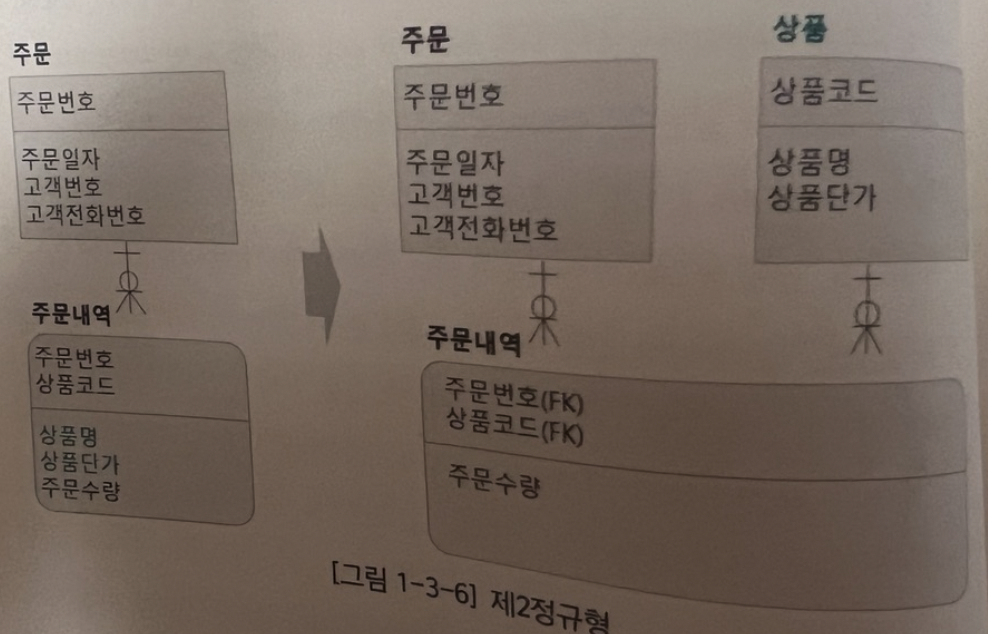

## 관계형 데이터 모델 이론

### 관계형 데이터 모델이란?

데이터를 2차원 테이블 형식으로 정의하고 표현한 모델. 그리고 이러한 테이블 형태를 릴레이션이라고 부른다.

테이블과 릴레이션이 동일한 개념인듯 하다.

### 릴레이션을 구성하는 것

스키마, 인스턴스(튜플)이다.

스키마는 릴레이션명과 어트리뷰트를 가진다. 릴레이션명이 테이블 명이고, 어트리뷰트가 필드, 컬럼을 뜻하는것 같다.

인스턴스(튜플)은 데이터 자체를 말하는것 같다.

### 관계형 모델의 키

#### 슈퍼키

튜플(데이터)을 고유하게 식별 할 수 있는 속성 집합을 말한다. 릴레이션은 한 개 이상의 슈퍼키를 가질 수 있으며, 슈퍼 키 값은 모든 튜플에서 유일해야한다.

집합이니깐 여러개의 어트리뷰트로 구성이 가능하다. 사원테이블을 예시로 든다면, 사원번호, {사원번호, 사원명}으로 특정 사원을 식별 할 수 있다.

### 후보키

튜플을 고유하게 식별 할 수 있는 최소한의 속성 집합을 후보키라고 한다. 슈퍼키 사원번호, {사원번호, 사원명}가 존재한다면, 사원번호가 후보키이다.

### 기본키

릴레이션은 하나 이상의 후보 키를 가지고, 그 중 하나만을 기본 키로 선택할 수 있다. 후보키와 동일하게 최소성과, 유일성을 가진다.

### 외래키

어떤 릴레이션의 어트리뷰트(필드) 값이 다른 릴레이션에 속한 어트리뷰트의 기본 키를 참조하는 경우

### 제약조건

제약조건은 키 제약조건과 무결성 제약조건으로 나눌 수 있다.

### 무결성 제약조건

#### 실체무결성

릴레이션의 기본키를 구성하는 모든 어트리뷰트는 NULL값이 아니어야하고, 릴레이션 내에서 오직 하나의 값만 존재해야 한다.

#### 영역무결성

주문수량이 소수점을 포함하지 않는 정수 값인 것 처럼 릴레이션 내에서 오직 하나의 값만 존재해야 한다.

#### 참조무결성

자식 릴레이션의 외래키는 참조하는 부모 릴레이션의 기본키 값이외의 값을 가질 수 없다.

#### 함수 종속

관계 스키마(테이블) 중에서 어느 속성군의 값이 정해지면 다른 속성군의 값이 정해지는 것

#### 완전 함수종속

임의의 릴레이션 R에서 속성 또는 속성들의 집합 X에 대해 Y가 함수적으로 종속되나, X의 부분 집합에 대해서는 함수적으로 종속되지 않은 경우

기본키가 주문번호, 상품코드로 구성되었다고 가정하면, 주문수량은 주문번호 또는 상품코드 개별적으로 종속되는것이 아니라 두개를 합친 조합에 종속됨으로 이것을 완전 함수종속이라고 부른다.

#### 부분 함수종속

완전하게 함수적으로 종속하지 않으면 부분 함수종속성을 갖는다.

여러 개의 속성이 모여서 하나의 기본키를 이룰 경우, 기본키를 구성하는 일부 속성만으로도 종속관계가 결정되면 부분 함수 종속이라고 한다.

기본키가 주문번호, 상품코드로 구성되었다고 가정하면 상품단가는 기본키의 일부인 상품코드에 의해 결정된다. 이것을 부분 함수 종속이라고 한다.

#### 이행적 함수종속

함수 종속 관계가 X->Y, Y->Z 가 되면 X->Z가 된다.

이행적 함수종속은 데이터 변경 이상의 원인이 된다. 예를 들어 주문번호를 알면 고객번호를 알 수 있고, 고객번호를 알면 고객명을 알 수 있으므로, 주문번호를 알면 고객번호를 알 수 있다.

#### 정규화

함수적 종속성과 같은 이론에 근거해서 관계형 데이터베이스의 테이블에 대해 데이터를 입력, 수정, 삭제할 때 발생하는 이상현상을 최소화하기 위해 좀 더 작은 단위의 테이블로 설계하는 과정

#### 정규화의 이점

1. 데이터를 입력, 수정, 삭제하는 과정에서 발생하는 이상 현상을 최소화할 수 있다.
2. 상호 종속성이 강한 데이터 요소들을 분리하여 독립된 개념으로 정의함에 따라 높은 응집력과 낮은 결합도 원칙에 충실하면서, 데이터 구조 변경 시 유연성이 증가한다.
3. 개념을 좀 더 작은 단위로 세분할 경우 해당 개념에 대한 재활용성이 높아진다 -> 참조 모델에 관련해서 말하는 것 같음
4. Non-Key 데이터 요소가 한번만 표현됨에 따라 중복을 최소화해서 저장공간을 최소화한다. -> 빈값을 예방한다는 말 같다.
5. 데이터 입력, 수정 ,삭제에 대한 작업을 최소화해서 수행속도 증가 -> 정규화하면 중복되는 데이터가 없어서 하는말 같다.

#### 정규화를 너무 심하게 한다면?

정규화를 너무 심하게 할 경우 조인이 빈번하게 발생해서 성능이 저하되지 않을까 걱정할 수 있지만, 조인이 발생한다는 사실은 맞지만, 이로 인해 반드시 성능문제가 발생한다고는 볼 수 없다.

조인이 원인이라기보다는 데이터베이스 특성을 고려하지 않고 사용할 때 발생하는 경우가 더 많다.

#### 제1정규형

중복되는 행이 없어야하고, 모든 열의 값은 원자 값을 가져야 한다. -> 중복 열과 다중 값을 가지면 안된다

#### 제2정규형

제 1정규형을 만족하고, 키가 아닌 어트리뷰트는 후보키 전체에 종속되어야 한다.

주문내역에서 상품명, 상품단가는 기본키인 주문번호, 상품코드 전체에 종속되어 있는 것이 아니라 기본키의 일부인 상품코드에 종속되어 있다.(부분 함수적 종속)

제2정규형을 만족하기 위해 별도 테이블인 상품 테이블을 추가하고, 컬럼(상품코드)을 상품 테이블로 분리해야 한다.

#### 제3정규형

제 2정규형을 만족하고, 키가 아닌 어트리뷰트들 간에는 서로 종속적인 관계가 없어야한다. 즉 키가 아닌 어떤 어트리뷰트가 다른 어트리뷰트에 종속된 경우 별도 릴레이션으로 분리해야 한다.

주문 테이블에서 고객명, 고객전화번호는 기본키가 아닌 고객번호에 종속되어 있으므로 별도 테이블 고객으로 분리해야한다. 이때 분리된 테이블의 기본키로 고객번호(결정자)를 지정한다.

