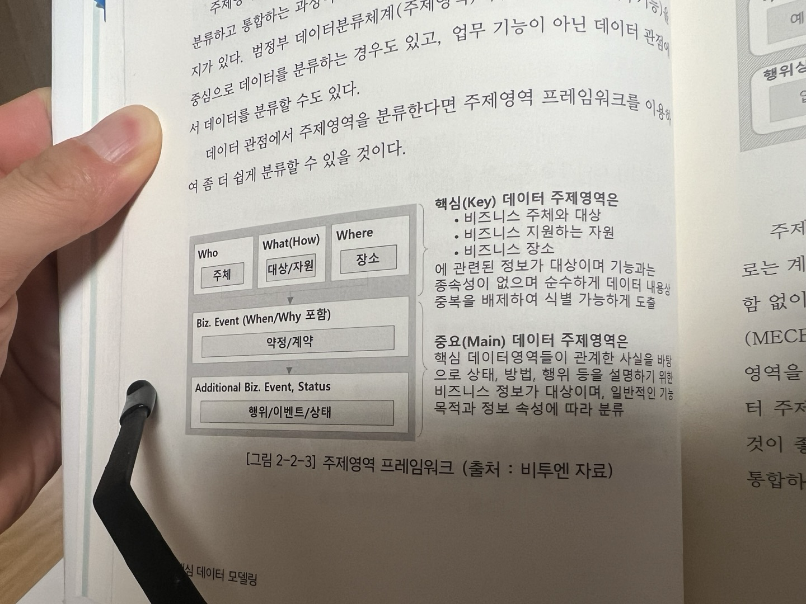
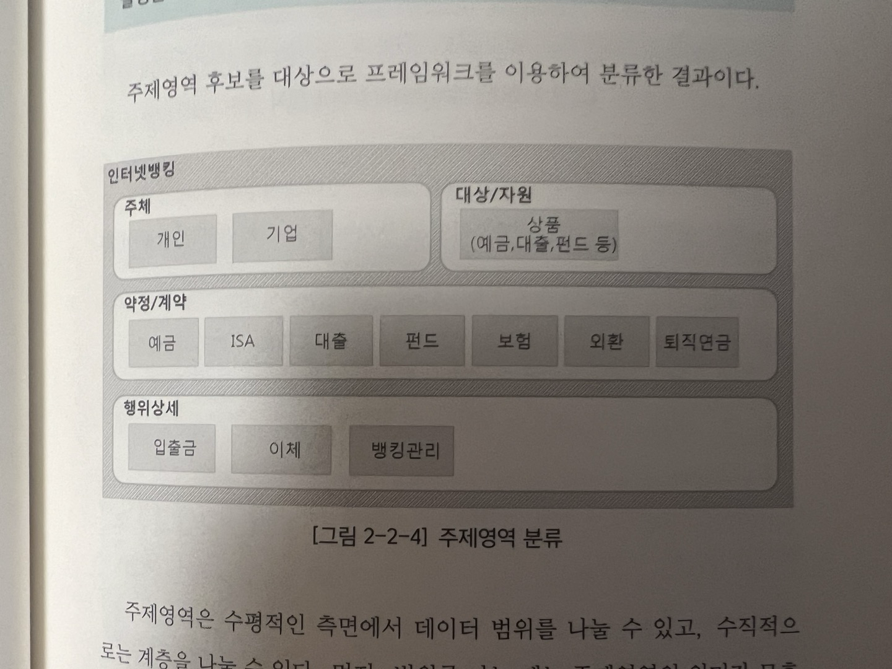

## 개념모델링

### 개념모델링이란

데이터 분석 과정에서 수립한 방향성에 맞게 전체적인 관점에서 개략적인 데이터 모델을 제시하는 단계

-> 요구사항을 분석해서 테이블을 생성하는 단계인것 같다.

### 개념모델링 과정

1. 주제영역 도출
2. 주제영역 분류 및 정의
3. 핵심 엔티티 정의 및 관계 정의

### 주제영역

주제영역은 기업이나 기관이 관리하는 데이터를 일관된 기준을 가지고 최상위 단계에서 분류한 데이터 집합이다.

기업에서 보유하거나 관리하는 데이터가 무엇인지 누가 관리하는지 큰 틀에서 파악할 수 있다는 특징을 가지고 있다.

-> 회사 자체의 도메인 따라서, 규칙을 정하고 구분해서 데이터 집합을 선별하는 것을 의미하는 것 같다.

문서화를 할 때 이 개념을 안다면 좋을 것 같다.

#### 주제 영역의 업무관점

전사 차원에서 관리하는 데이터 분석을 통해 조직에서 발생한 데이터들을 서로 연결해서 업무 처리 효율을 높힐 수 있다.

#### 주제 영역의 시스템 관점

할당된 IT 자원을 파악할 수 있어서 중복적인 일을 하는 것들을 예방할 수 있다. -> 문서화의 중요성을 말하는 것 같음

#### 주제 영역의 데이터 관리

데이터에 대한 통합, 연계, 중복등에 대한 방안을 수립하는데 기초자료로 사용이 된다.

#### 주제 영역의 데이터 설계

논리 모델, 물리 모델로 구체화할 때 방향성을 잡는데 도움이 된다.

이게 나한테 도움이 되는건가..

### 주제 영역 분류

주제영역 후보를 도출했으면 기준에 따라 데이터를 분류해야한다.

데이터 관점에서 주제영역을 분류한다면 아래를 참고하면 된다.

박찬얼(주체)는 은행 영업점(장소)를 방문하여 급여통장(대상/자원)을 만들고, 인터넹 뱅크 서비스(대상/자원)도 신청했다.

와 같이 분류할 수 있다. 이 기술은 배워두면 도움이 될 것 같다.

주제영역은 수평적인 측면에서 데이터 범위를 나눌 수 있고, 수직적으로 계층을 나눌 수 있다.

#### MECE

주제영역이 중복되지 않으면서 누락이 없어야 한다(MECE)

약정/계약에 속하는 엔티티끼리 서로 교집합은 없어야하고, 예금 ~ 퇴직연금까지 합집합이 상품이 되어야한다.
